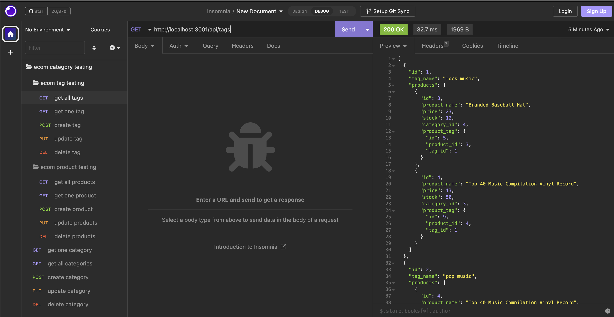
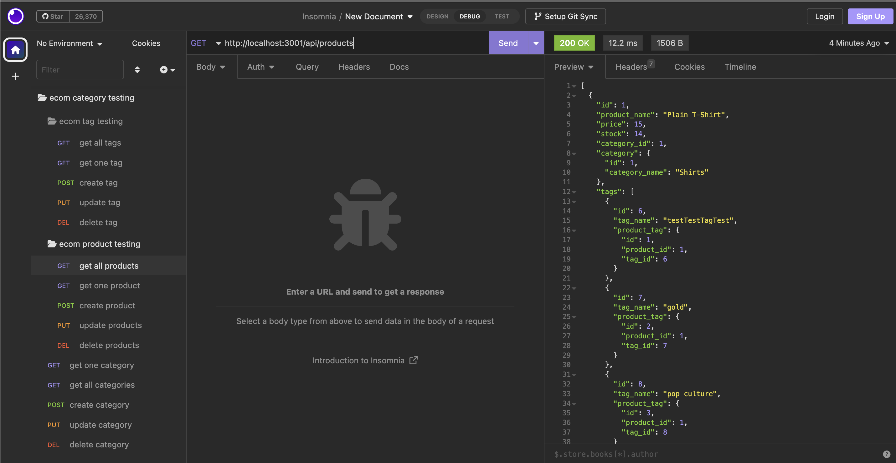
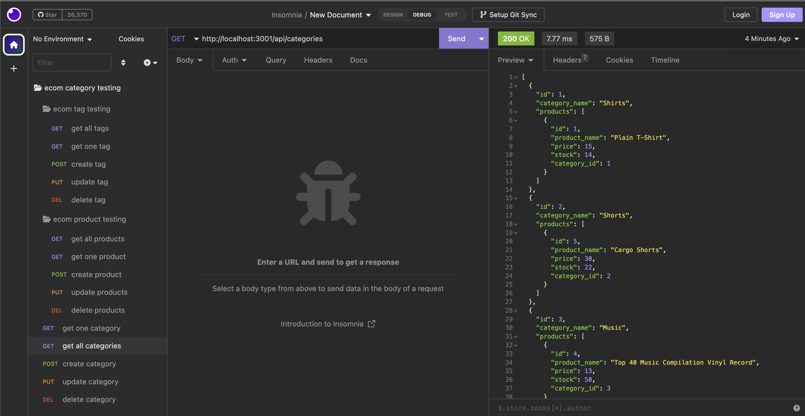

# Ecom
# About
A back end for an e-commerce, configured with a working Express.js API to use Sequelize to interact with a MySQL database.

# Installation
To use this application the user must install the following:

Package.json - `npm install` in the command line.

dontenv - story log in information to access the database

MySQL2 - `npm i mysql2@2.2.5` in the command line.

Express- `npm i express4.17.1` in the command line.

The user will also need sequelize and insomnia to test and view the back-end working.

# Description
This application is for anyone wanting to use a database to manage the details of their ecommerce buisness. They can add,update and delte details of their stock using product name, tag id or even a category the item is in.

# Mock-up
The following images show the applications functionality and appearance.

# Links

## Github Repo
https://github.com/KyleKarotko/Ecom
## Video of running application
https://drive.google.com/file/d/1PIFkG5_sv0Ss4tZln82Ew40DJml0sz_L/view